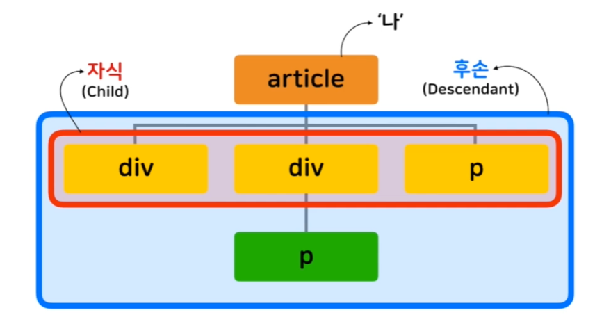
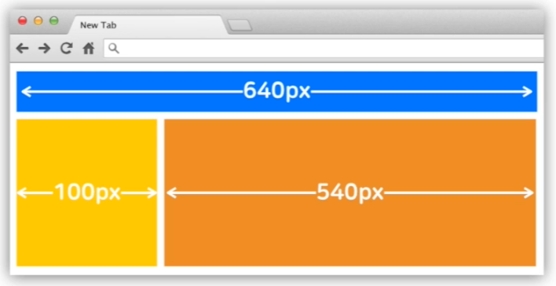
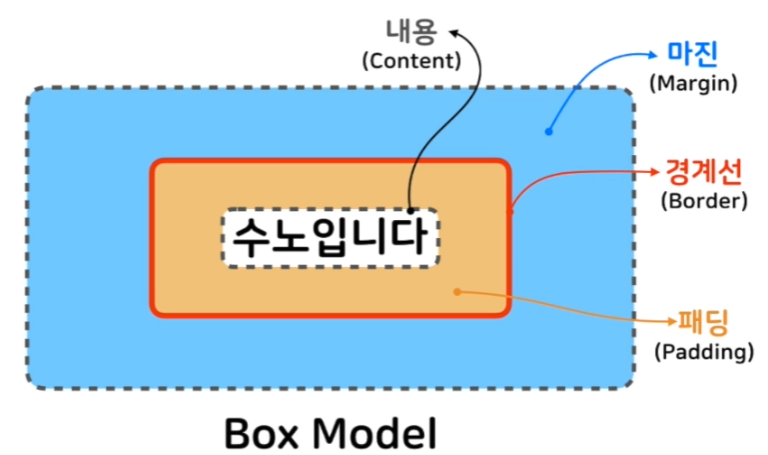
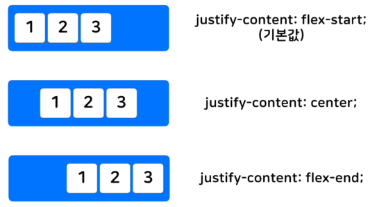
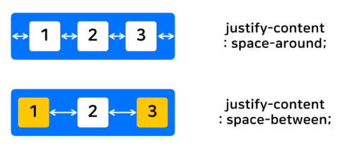
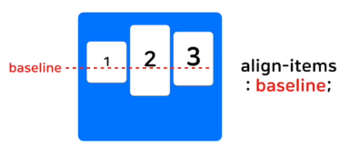
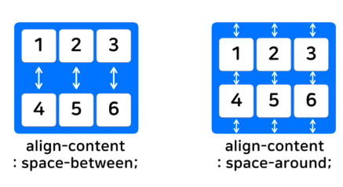

# CSS 기초

### CSS(Cascading Style Sheet)

* 웹에 적용할 스타일 명세서

* ```css
  p {
      font-family: "맑은 고딕";
  	font-size: 18px;
  	color: blue;
  }
  ```

* **선택자(Selector):** 스타일 적용하고자 하는 HTML 요소 선택하는 역할

  * p, h1, div 등

* **속성(Property):** 지정할 스타일의 속성명(; 으로 구분)

  * font-family, color 등

* **값(value):** 특정 단위, 키워드를 명시해서 스타일 적용. 속성과 쌍을 이룸(e.g. property: value)

  * blue, red, 18px 등

* 선언(Declaration): (속성:값;) 으로 이루어진 한 쌍

* 선언 블록: 선언들의 묶음으로, 중괄호({}) 안에서 묶임

<br>

### HTML에 CSS 적용법

* Link, Embedding, Inline

* **Link Style:** 외부에 있는 CSS 파일 불러와서 적용

  * 헤드 안에서 link 태그를 이용해서 적용

  * ```html
    <link rel="stylesheet" href="연결할 css 주소">
    ```

* **Embedding Style:** 태그를 이용해서 CSS 적용

  * 헤드 안에 style 태그를 이용해서 적용

  * ```html
    <style>
        h1 {color: red;}
    </style>
    ```

* **Inline Style:** HTML 요소에 직접 style 속성을 삽입해서 CSS 적용

  * 태그 안에 style 속성을 이용해서 적용

  * 삽입한 해당 요소에만 적용됨

  * ```html
    <h1 style="color: red;">안녕하세요</h1>
    ```


<br>


----------------

----

<br>


# 선택자

* 선택자 사용 태그: h1, span, div, p 등 

* ```css
  h1, p {
      color: red;
  }
  ```

  * 여러 선택자를 동시에 스타일 지정 가능

<br>

### 단순 선택자

* **타입(Type) 선택자:** 해당하는 태그의 모든 요소에 스타일 적용

  * ```css
    p { color: blue; }
    ```

* **아이디(Id) 선택자:** Id가 매치하는 요소에 적용

  * 아이디(Id): 동일한 Id는 존재할 수 없다 -> 유일성

  * 선택자 앞에 샾(#)을 붙여 사용

  * ```css
    #idname { color: red; } <!-- main 이라는 id에 적용 -->
    ```

* **클래스(Class) 선택자:** 클래스가 같은 요소에 모두 적용

  * 클래스(Class): 비슷한 특징을 가지는 요소들의 묶음

  * 선택자 앞에 점(.)을 붙여 사용

  * ```css
    .classname { color: blue; }
    ```

* 전체(Universal) 선택자: 모든 요소에 스타일 적용

  * 속도 저하 가능성이 있음 -> 안쓰는게 좋다

  * 선택자 앞에 별(*) 붙여 사용

  * ```css
    * { color: red; }
    ```

* **속성(Attribute) 선택자:** 특정 속성 소유하는 모든 요소에 스타일 적용

  * 사용법: 선택자[속셩명="속성값"] { color: red; }

  * ```css
    a[target="_blank"] { color: red; }
    <!-- or -->
    #id[target="_blank"] { color: red; }
    ```

<br>

### 복합 선택자

* 자식(Child)과 후손(Descendant)의 개념

  * 	

* **자식(Child) 선택자:** **선택자 A**의 모든 자식중 **선택자 B**와 일치하는 요소 선택

  * 사용법: 선택자A > 선택자B { color: red; }

  * 바로 아래의 자식에만 적용됨

  * ```css
    <style>
    	article > p { color: red; }
    </style>
    ```

* **후손(Descendant) 선택자:** 자식선택자와 마찬가지지만 후손까지 적용

  * 사용법: 선택자A 선택자B { color: blue; }

  * 모든 후손들에 적용

  * ```css
    article p { color: blue; }
    ```

<br>

### 가상(Pseudo) 클래스

* 요소의 특별한 상태를 지정할 때 씀

* 사용법: 선택자:pseudo-class { 속성: 값; }

* **:link 가상 클래스**

  * 방문하지 않은 링크일 경우

  * ```css
    a:link { color: yellow; }
    ```

* **:visited 클래스**

  * 방문한 링크일 경우

* **:hover 클래스**

  * 요소에 마우스가 올라와 있을 경우


<br>

---

---

<br>


# 값과 단위

### 값의 종류

* 숫자값, 키워드, 색상, 등

* **숫자값:** 글자 사이즈, 높이, 너비 등 조정할 때 사용
  * 절대적인 길이: px
    * **px(pixel):** 1px = 약 1/96 인치 -> 절대적인 길이
  * 상대적인 길이: em, rem -> 기준 폰트 크기의 배수
    * **em:** 현재 요소의 font-size 기준 ->상대적인 길이
    * **rem:** 최상위 요소의 font-size 기준 -> 상대적인 길이
    * **%(퍼센트):** 이미지나 레이아웃 너비, 높이 지정할 때 씀 -> 상대 길이

  * 상대값 사용 이유: 모니터 사이즈, 모바일 환경 등 다양한 화면 크기 -> 상대값이 더 안전함 -> **rem 사용 권장!**

* **색상:**
  * **키워드 지정:** blue, red, 등...
  * **hex code:** #ffffff, #dd3333, 등...
  * **rgb:**  rgb(0,0,0), rgb(255,0,0,.5), 등...


<br>

-----

-----

<br>


# 텍스트와 관련된 프로퍼티(Property)

### 폰트 관련 프로퍼티

* font-size, font-family, font-size, font-weight, 등

* **font-family:** 폰트 종류를 지정

  * ```css
    font-family: 'Cute Font', Arial, cursive
    ```

  * 여러 폰트를 지정 가능 -> 앞에서부터 해당 폰트가 없으면 그 다음 폰트 적용

  * 맨 마지막 폰트는 모든 OS가 지원하는걸(일반 글꼴)로 하는게 좋다!

  * **일반 글꼴:** serif, monospace, 등...

  * **웹 폰트:** 구글 등에서 링크 태그로 폰트 불러오는 방식

    * e.g. Google Fonts

* **font-style:** 이탈릭체, 볼드체 등 스타일 적용

  * normal: 기본 글자체
  * italic: 이탈릭 스타일 글자체
  * oblique: 글자를 기울임

* **font-weight:** 폰트 굵기 지정

  * 100 부터 900 까지
  * 400은 normal 정도
  * 700은 bold 정도

* **font:** 폰트 스타일을 한번(한줄)에 적용

  * ```css
    font: oblique 900 35px Arial, sans-serif;
    ```

<br>

### 텍즈트 정렬 관련 프로퍼티

* **text-align:** 텍스트 좌, 우, 중앙 정렬
  * 값: left, right, center
  * 본인 요소를 기준으로 정렬 됨
* **line-height:** 문장 위아래 간격 조정
  * 값: 24px, 2(두배)
* **letter-spacing:** 글자 사이 간격 조정
* **text-indent:** 문장 시작부분 들여쓰기 여부


<br>

----

----

<br>


# 박스 모델

* HTML의 모든 요소는 박스 형태이다
  * 	

<br>

* **박스 모델:** 
  * 	
    * 내용(Content): 실제 내용을 담는 박스
    * 경계선(Border): 내용을 감싸는 테두리 선
    * 패딩(Padding): 경계선 기준 안쪽의 여백
    * 마진(Margin): 경계선 기준 밖의 여백

<br>

* **내용(Content)**

  * height, width로 크기 조정
  * 내용이 너무 커지면 제대로 표시 안될수도 있음

* **경계선(Border):** 

  * ```css
    border-style: dashed solid dotted double;
    border-width: 6px 8px;
    border-color: red green;
    ```

    * style, width, color 속성으로 다양한 스타일 지정
    * 상하좌우 따로 지정 가능

  * ```css
    border: 4px solid red;
    ```

    * 한줄로 한번에 스타일 지정 가능

  * ```css
    border-radius: 10px
    ```

    * 모서리를 얼마나 둥글게 할지 지정
    * 10px 은 모서리 원의 반지름임
    * border-top-left-radius, 등 각 모서리 따로 지정 가능

* 마진과 패딩(Margin, Padding)

  * 4 방향 따로, 혹은 한번에 지정 가능
  * 두개의 **마진이 충돌**하면, **마진 상쇄** 일어남
    * 상하 마진중 큰쪽만 적용됨

  <br>

* Box Sizing 속성: width, height의 기준을 변경

  * 내용(Content)를 기준으로 변경 -> 디폴트는 이거
    * box-sizing: content-box;
  * 경계선(Border)를 기준으로 변경
    * box-sizing: border-box;
    * 내용 + 패딩 + 경계선 두께 까지 모두 합한게 기준이 됨


<br>

----

-----

<br>


# 위치와 관련된 프로퍼티(Property)

### Display

* 요소가 보여지는 방식 지정

* ```css
  display: block;
  ```

* block(기본값), inline 요소로 나뉨

* **block 요소:** 

  * 항상 새로운 줄에서 시작

  * 너비 100%를 기본으로 가짐

  * ```html
    <div>, <h1>~<h6>, <p>, <header>, 등등...
    ```

  * width, height, margin, padding 등 **지정 가능**

* **inline 요소:** 

  * 새로운 줄에서 시작 안함

  * 필요한 만큼(내용 만큼)만 너비를 가짐

  * ```html
    <a>, <span>, , 등등...
    ```

  * width, height, margin-top, margin bottom **지정 불가능!**

* **inline-block 요소:** 

  * inline과 기능 동일
  * width, height, margin-top, margin bottom **지정 가능!**

* none 요소:

  * 브라우져에 해당 요소 출력 못하게함

<br>

### Position

* 요소의 위치를 정의

* ```css
  position: relative;
  ```

* static(기본값), relative, absolute, fixed

* **static 요소:**

  * 좌표 프로퍼티 못씀

* **relative 요소:**

  * 상대 위치
  * 기본 위치를 기준으로 움직임
  * top, left 등을 이용해 상대 위치 조정

* **absolute 요소:**

  * 절대 위치
  * 부모, 조상 중 relative, absolute, fixed가 선언된 곳을 기준으로 움직임
  * 너비가 inline 처럼 변함 -> 너비 조정은 가능

* **fixed 요소:** 

  * 보이는 화면을 기준으로 위치 고정
  * 화면이 움직여도(스크롤 등) 항상 그 위치에 고정되어서 보임

* **z-index:**

  * 출력 우선순위(층) 지정
  * 높을수록 우선순위 높아짐


<br>

-----

-----

<br>


# 위치와 관련된 프로퍼티 (2)

### Flexbox

* 크기가 불분명한 요소들에 대해서 효율적으로 정렬

* **flex conatainer(부모요소)** + **flex item(자식요소)** 으로 구성
* ```display: flex;``` 를 추가하여 flex container로 만듦
* container 안의 요소들은 flex item 자식요소들이 됨

<br>

### Flex container(부모 요소)

* ```css
  #container {
      display: flex;
      flex-direction: row-reverse;
      height: 500px;
      flex-wrap: wrap;
      justify-content: flex-end;
      align-items: center;
  }
  ```

* **flex-direction:** 컨테이너 안의 item들 방향을 정함

  * 가로 정렬: ```row(기본값), row-reverse ```
  * 세로 정렬: ```column, column-reverse```

* **flex-wrap:** flex item이 컨테이너 벗어 날 때 줄을 바꾸는 속성

  * 줄 바꿈 없음: ```nowrap```
  * 줄 바꿈 있음: ```wrap```

* **flex-flow:** direction, wrap을 한번에 지정

  * ```flex-flow: row wrap;```

* **justify-content:** direction으로 정해진 방향을 기준으로 **수평으로** item을 정렬하는 방법 지정

  * 시작, 중간, 끝 정렬: 
    * ```flex-start(기본값), center, flex-end```
      * 	
  * 동일한 간격으로 정렬: 
    * ```space-around, space-between```
      * 	

* **align-items:** direction으로 정해진 방향을 기준으로 **수직으로** item을 정렬

  * ```stretch(기본값), flex-start, flex-end, center```
    * 	
  * ```baseline``` : 안의 글자의 기준선을 기준으로 정렬
    * 	

* **align-content:** direction으로 정해진 방향을 기준으로 **수직으로 *여러줄인***  item을 정렬

  * ```stretch(기본값), flex-start, flex-end, center, space-around, space-between```
    * 	

<br>

### Flex item(자식 요소)

* **flex-grow:** flex item 확장과 관련된 속성

  * ```0(기본값), 1, 2, ...```
    * 	

* **flex-shirnk:** flex item 축소와 관련된 속성

  * ```0, 1(기본값), 2, ...```
  * 	

* **flex-basis:** flex item 기본 크기를 결정함

  * ```auto(기본값), 0px, 10px, 20px, ...```

* **flex:** grow, shrink, basis 한번에 설정

  * ```css
    flex: 1(grow) 0(shrink) auto(basis)
    ```


<br>

----

-----

<br>


# 상속과 우선순위

### 상속

* **상속:** 부모 요소에 스타일을 적용하면 **자식 요소들 모두 적용됨 **
* *모든 CSS 프로퍼티가 상속되는 것은 아님!!*
* <a href="https://www.w3.org/TR/CSS21/propidx">프로퍼티 상속 여부 테이블</a>
* 상속 안되는 프로퍼티 상속 받게 하는 법:
  * ```margin: inherit;``` 삽입

<br>

### 우선순위

* ***Cascading:*** CSS 적용 우선순위!

* **규칙:**

  1. **중요도**

     1.  ```<head>``` 태그 내의 ```<style>``` 태그
     2.  ```<head>``` 태그 내의 ```<style>``` 태그 내의 ```@import``` 문
     3.  ```<link>``` 태그로 연결된 CSS
     4.  ```<link>``` 태그로 연결된 CSS 내의 ```@import``` 문 브라우저 디폴트 스타일시트

     * 한 마디로 ```<head>``` 가 ```<link>``` 보다 중요도 높음

  2. **명시도**

     1. ```!important```: 프로퍼티 값에 세미콜론 찍기 전에 이거 적으면 됨. 무적의 키워

        * ```css
          p { color: red !important; }
          ```

     2. inline style

     3. id selector(선택자) -> 웬만하면 쓰지 말것, 클래스 선택자를 쓸것

     4. 클래스, 속성, 가상클래스 선택자

     5. 태그 선택자

     6. 전체 선택자(*)

     7. 상속(inherit)

  3. **선언 순서:** *나중 선언* 스타일이 **우선적용**


<br>

-----

-----

<br>


# Bootstrap

### 소개 및 시작

* 중복 CSS 코드 줄이는 법:

  * 정의한 스타일을 상속해서 바꾸고 싶은 부분은 덮어쓰면 된다:

    * ```css
      .btn {
          cursor: pointer;
          border: none;
          padding: 4px 20px;
          background: red;
          color: white;
      }
      
      .btn-login {
          border: 2px solid black;
          background: black;
      }
      ```

  * 이 CSS를 적용하기:

    * ```html
      <button class="btn btn-login">로그인</button>
      ```

* **부트 스트랩:** 오픈 소스 프런트엔드 프레임워크

  * 헤드 태그의 링크 태그에 삽입

<br>

### 다양한 기능들

* 폼과 버튼
* 그리드 시스템 
  * 바둑판에 두듯 배치 가능
  * container를 이용해서 안에 row, col를 집어 넣음
  * 그리드는 정확히 12개의 col를 가짐
  * 반응형 웹 구현도 가능
    * lg, sm, md, xl 등을 이용함
  * ```.col-lg-4```
    * lg: 기준이 되는 화면의 사이즈
    * 4: 12등분 중 차지할 비율
* 충돌 없이 부트 스트랩 프로퍼티 덮어주는 방법
  * 부트 스트랩은 ```.class``` 클래스 선택자 사용한다
  * ```!important```, 아이디 선택자, 클래스 타입 선택자(div.class) 사용해서 덮어주자
* 더 다양한 기능들을 검색해서 찾자!!


