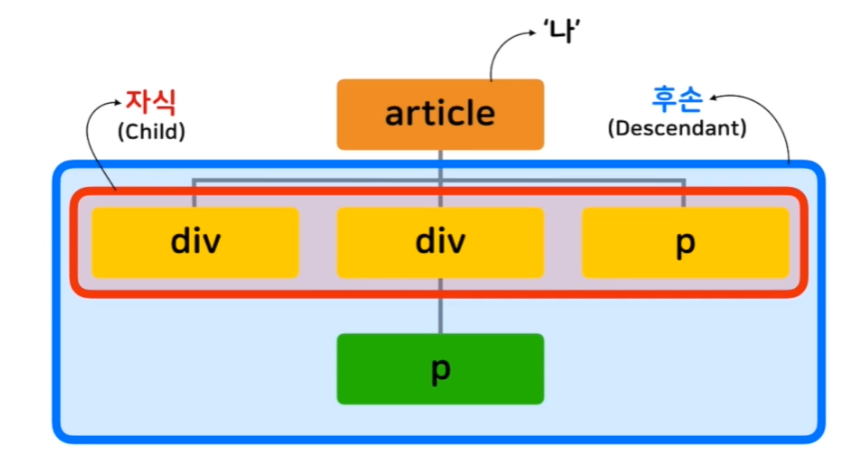

## 선택자

* 선택자 사용 태그: h1, span, div, p 등 

* ```css
  h1, p {
      color: red;
  }
  ```

  * 여러 선택자를 동시에 스타일 지정 가능

<br>

* **단순 선택자**

  * **타입(Type) 선택자:** 해당하는 태그의 모든 요소에 스타일 적용

    * ```css
      p { color: blue; }
      ```

  * **아이디(Id) 선택자:** Id가 매치하는 요소에 적용

    * 아이디(Id): 동일한 Id는 존재할 수 없다 -> 유일성

    * 선택자 앞에 샾(#)을 붙여 사용

    * ```css
      #idname { color: red; } <!-- main 이라는 id에 적용 -->
      ```

  * **클래스(Class) 선택자:** 클래스가 같은 요소에 모두 적용

    * 클래스(Class): 비슷한 특징을 가지는 요소들의 묶음

    * 선택자 앞에 점(.)을 붙여 사용

    * ```css
      .classname { color: blue; }
      ```

  * 전체(Universal) 선택자: 모든 요소에 스타일 적용

    * 속도 저하 가능성이 있음 -> 안쓰는게 좋다

    * 선택자 앞에 별(*) 붙여 사용

    * ```css
      * { color: red; }
      ```

  * **속성(Attribute) 선택자:** 특정 속성 소유하는 모든 요소에 스타일 적용

    * 사용법: 선택자[속셩명="속성값"] { color: red; }

    * ```css
      a[target="_blank"] { color: red; }
      <!-- or -->
      #id[target="_blank"] { color: red; }
      ```

<br>

* **복합 선택자**

  * 자식(Child)과 후손(Descendant)의 개념

    * 

  * **자식(Child) 선택자:** **선택자 A**의 모든 자식중 **선택자 B**와 일치하는 요소 선택

    * 사용법: 선택자A > 선택자B { color: red; }

    * 바로 아래의 자식에만 적용됨

    * ```css
      <style>
      	article > p { color: red; }
      </style>
      ```

  * **후손(Descendant) 선택자:** 자식선택자와 마찬가지지만 후손까지 적용

    * 사용법: 선택자A 선택자B { color: blue; }

    * 모든 후손들에 적용

    * ```css
      article p { color: blue; }
      ```

<br>

* **가상(Pseudo) 클래스**

  * 요소의 특별한 상태를 지정할 때 씀

  * 사용법: 선택자:pseudo-class { 속성: 값; }

  * **:link 가상 클래스**

    * 방문하지 않은 링크일 경우

    * ```css
      a:link { color: yellow; }
      ```

  * **:visited 클래스**

    * 방문한 링크일 경우

  * **:hover 클래스**

    * 요소에 마우스가 올라와 있을 경우

