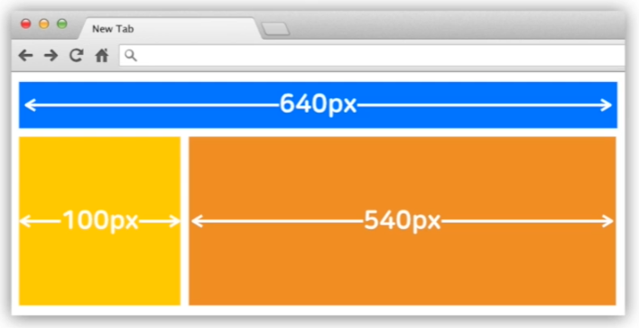
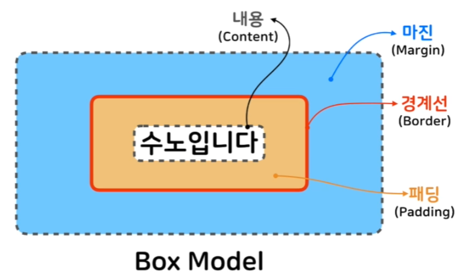

# 박스 모델

* HTML의 모든 요소는 박스 형태이다
  * 

<br>

* **박스 모델:** 
  * 
    * 내용(Content): 실제 내용을 담는 박스
    * 경계선(Border): 내용을 감싸는 테두리 선
    * 패딩(Padding): 경계선 기준 안쪽의 여백
    * 마진(Margin): 경계선 기준 밖의 여백

<br>

* **내용(Content)**

  * height, width로 크기 조정
  * 내용이 너무 커지면 제대로 표시 안될수도 있음

* **경계선(Border):** 

  * ```css
    border-style: dashed solid dotted double;
    border-width: 6px 8px;
    border-color: red green;
    ```

    * style, width, color 속성으로 다양한 스타일 지정
    * 상하좌우 따로 지정 가능

  * ```css
    border: 4px solid red;
    ```

    * 한줄로 한번에 스타일 지정 가능

  * ```css
    border-radius: 10px
    ```

    * 모서리를 얼마나 둥글게 할지 지정
    * 10px 은 모서리 원의 반지름임
    * border-top-left-radius, 등 각 모서리 따로 지정 가능

* 마진과 패딩(Margin, Padding)

  * 4 방향 따로, 혹은 한번에 지정 가능
  * 두개의 **마진이 충돌**하면, **마진 상쇄** 일어남
    * 상하 마진중 큰쪽만 적용됨

  <br>

* Box Sizing 속성: width, height의 기준을 변경

  * 내용(Content)를 기준으로 변경 -> 디폴트는 이거
    * box-sizing: content-box;
  * 경계선(Border)를 기준으로 변경
    * box-sizing: border-box;
    * 내용 + 패딩 + 경계선 두께 까지 모두 합한게 기준이 됨