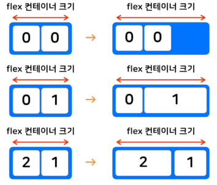

# 위치와 관련된 프로퍼티 (2)

### Flexbox

* 크기가 불분명한 요소들에 대해서 효율적으로 정렬

* **flex conatainer(부모요소)** + **flex item(자식요소)** 으로 구성
* ```display: flex;``` 를 추가하여 flex container로 만듦
* container 안의 요소들은 flex item 자식요소들이 됨

<br>

### Flex container(부모 요소)

* ```css
  #container {
      display: flex;
      flex-direction: row-reverse;
      height: 500px;
      flex-wrap: wrap;
      justify-content: flex-end;
      align-items: center;
  }
  ```

* **flex-direction:** 컨테이너 안의 item들 방향을 정함

  * 가로 정렬: ```row(기본값), row-reverse ```
  * 세로 정렬: ```column, column-reverse```

* **flex-wrap:** flex item이 컨테이너 벗어 날 때 줄을 바꾸는 속성

  * 줄 바꿈 없음: ```nowrap```
  * 줄 바꿈 있음: ```wrap```

* **flex-flow:** direction, wrap을 한번에 지정

  * ```flex-flow: row wrap;```

* **justify-content:** direction으로 정해진 방향을 기준으로 **수평으로** item을 정렬하는 방법 지정

  * 시작, 중간, 끝 정렬: 
    * ```flex-start(기본값), center, flex-end```
      * 
  * 동일한 간격으로 정렬: 
    * ```space-around, space-between```
      * 

* **align-items:** direction으로 정해진 방향을 기준으로 **수직으로** item을 정렬

  * ```stretch(기본값), flex-start, flex-end, center```
    * 
  * ```baseline``` : 안의 글자의 기준선을 기준으로 정렬
    * 

* **align-content:** direction으로 정해진 방향을 기준으로 **수직으로 *여러줄인***  item을 정렬

  * ```stretch(기본값), flex-start, flex-end, center, space-around, space-between```
    * 

<br>

### Flex item(자식 요소)

* **flex-grow:** flex item 확장과 관련된 속성

  * ```0(기본값), 1, 2, ...```
  * 

* **flex-shirnk:** flex item 축소와 관련된 속성

  * ```0, 1(기본값), 2, ...```
  * 

* **flex-basis:** flex item 기본 크기를 결정함

  * ```auto(기본값), 0px, 10px, 20px, ...```

* **flex:** grow, shrink, basis 한번에 설정

  * ```css
    flex: 1(grow) 0(shrink) auto(basis)
    ```


