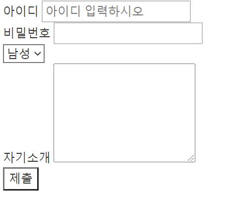

# Intro

* HTML, CSS 는 프밍언어가 아니다!
* 웹 구성: HTML + CSS + Javascript

* HTML(Hyper Text Markup Language): 구조
  * Hyper Text: 링크를 누르면 그곳으로 이동
  * Markup Language: 태그를 이용해 문서를 구조화

* CSS(Cascading Style Sheets): 스타일
  * Style Sheets: 웹페이지의 스타일을 정리해둔 문서
  * Cascading: 스타일 적용 우선순위 -> 폭포(Cascade)같음

* Javascript: 동작
  * 셋 중 유일하게 프로그래밍 언어
  * 웹과 사용자간 상호작용을 위한 언어


-----

----


# HTML 기초

* 요소(element)

  * <시작태그> 내용 </종료태그> -> 이런 구조
  * 태그 이름은 소문자를 권장


* ```HTML
  <!DOCTYPE html>
  ```

  * 문서 형식을 정의
  * 필수적으로 맨 앞에 존재해야함


* ```html
  <html lang="kr"></html>
  ```

  * 무조건 하나만 존재
  * lang: 사용하는 주 언어


* ```html
  <head></head>
  ```

  * 문서의 정보를 담음

  * 단 하나만 존재

  * ```html
    <meta charset="utf-8">
    ```

    * 문서 관련 정보 담음
    * charset: 한글이 깨지지 않도록 도움

  * ```html
    <title>제목</title>
    ```

    * 웹 페이지의 제목을 담음


* ```html
  <body></body>
  ```

  * 무조건 하나만 존재
  * head 아래에 있어야함
  * 실질적으로 보여지는 부분


* Semantic tag: 의미를 갖는 태그

  * header: 제목 혹은 소개를 담음
  * nav: 페이지 이동 위한 메뉴
  * section: 구획을 구분하기 위해 사용
  * article: 주 내용을 담음(하나의 주 내용)
  * aside: 광고나 부수적인 내용 담음
  * footer 웹 맨 아래에 들어감, 회사 추가정보 등 담음


----

----


# 텍스트와 관련된 태그

* 제목 태그

  * 제목을 나타낼 때 사용
  * 중요도에 따라 h1(대제목) ~ h6(소제목)를 씀


* 본문 태그

  * ```html
    <p>내용</p>
    ```

    * paragraphs: 단락, 문단 태그

  * ```html
    <br> <!-- 종료태그 없음 -->
    ```

    * break: 줄바꿈 태그
    * Empty element(빈 요소): 종료태그가 없음

  * ```html
    <pre>
    	내용1
    	내용2
    	내용3
    </pre>
    ```

    * preformatted: 형식화된 내용 태그
    * 적은 내용 그대로 출력됨(tab, enter 등)

  * ```html
    <strong>내용</strong>
    <em>내용</em>
    ```

    * strong: 볼드체화

    * emphasized: 이탈리체화

  * ```html
    <sub>내용</sub>
    <sup>내용</sup>
    ```

    * subscripted: 내용을 기본 위치의 위로 
    * superscripted: 내용을 기본 위치의 아래로

  * ```html
    <ins>내용</ins>
    <del>내용</del>
    ```

    * inserted: 내용에 밑줄
    * deleted: 내용에 취소선


-----

-----


# 링크 태그

* 하이퍼 링크: 하이퍼 텍스트를 가능하게 함

* ```html
  <a href="www.google.com" target="_self">이름</a>
  ```

  * **링크 태그(anchor)**
  * href 속성: 연결할 웹 사이트 주소
  * target 속성
    * "_self": 현재 탭에서 엶
    * "_blank": 새 탭에서 엶

* 속성(Attributes): 태그에 추가적인 정보 제공

  * 모든 태그가 속성을 가짐
  * **키 = "값"** 의 구조를 가짐 -> 큰 따옴표로 값을 감싸야함
  * 속성들은 키를 기준으로 한칸 씩 띄어져 있어야함


* 웹 사이트 주소

  * 경로(Path): "/" 를 사용하여 구분
  * URL(Uniform Resource Locater: 주소 + 경로로 구성
    * 인터넷 문서들의 자원 위치를 나타냄
  * 절대 URL vs 상대 URL


-----

----


# 멀티미디어와 관련된 태그

* ```html
  
  ```

  * **이미지 태그** 
  * src 속성(source): 불러올 이미지 URL
  * alt 속성(alternative): 이미지를 불러오지 못할 때 뜨는 문구
  * width, height 속성: 너비, 높이 조정 속성 -> **CSS를 이용해서 조정하는걸 권장!**


* ```html
  <iframe src="URL 주소"></iframe>
  ```

  * 오디오, 비디오 태그
  * 특별한 상황 아니고선 잘 안씀 -> 유튜브 올릴때 가끔 씀


-----

-----


# 테이블과 리스트

* 표(Table): 데이터 정리하고 정렬하기 좋음

  * 표(table) 구성 = 데이터 셀(td) + 제목 셀(th) + 행(tr)

* ```html
  <table> <!-- 테이블 태그 -->
      <tr> <!-- 행 태그 -->
          <th>제목 1</th> <!-- 제목 태그 -->
          <th>제목 2</th>
      </tr>
      <tr>
          <td>데이터 1</td> <!-- 데이터 태그 -->
          <td>데이터 2</td>
      </tr>
      <tr>
          <td colspan="2">데이터 3</td>
      </tr>
  </table>
  ```

  * rowspan 속성: 숫자 만큼 행을 점유

  * colspan 속성: 숫자 만큼 열을 점유

  * <table> <!-- 테이블 태그 -->
        <tr> <!-- 행 태그 -->
            <th>제목 1</th> <!-- 제목 태그 -->
            <th>제목 2</th>
        </tr>
        <tr>
            <td>데이터 1</td> <!-- 데이터 태그 -->
            <td>데이터 2</td>
        </tr>
        <tr>
            <td colspan="2">데이터 3</td>
        </tr>
    </table>

<br>

* 목록(List)

  * **순서 있는 목록(Ordered)**

  * ```html
    <ul> <!-- unordered list 태그 -->
        <li>아이템 1</li> <!-- 리스트 아이템 태그 -->
        <li>아이템 2</li>
    </ul>
    ```

    * <ul>
          <li>아이템 1</li> 
          <li>아이템 2</li>
      </ul>

  * **순서 없는 목록(Unordered)**

  * ```html
    <ol> <!-- ordered list 태그 -->
        <li>아이템 1</li> <!-- 리스트 아이템 태그 -->
        <li>아이템 2</li>
    </ol>
    ```

    * <ol> 
          <li>아이템 1</li> 
        <li>아이템 2</li>
      </ol>

    * start = "숫자": 리스트가 시작하는 숫자(3부터 시작 등)

    * type = "문자": 순서 시작 문자 정함(로마자 등)

    * reversed: 순서를 반대로 함

    * (li 태그 용)value = "숫자": 해당 리스트 아이템의 번호 지정

  * 리스트는 **중첩**이 가능 -> 리스트 아이템(li) 안에 리스트(ol, ul) 생성 가능


-----

----


# 폼 태그

* **폼(form) 태그:** 다양한 입력 양식 태그들을 감싸줌
* action 속성: 데이터 보낼 URL 지정
* method 속성: 보내는 방식 지정(Get, Post)
* GET 방식: 데이터를 URL 끝에 넣고 보냄
  * 데이터 조회를 목적으로 많이 쓰임
  * 검색 등에 쓰임
* POST 방식: 데이터를 보이지 않게 보냄(Body 부분에)
  * Header + Body로 구성됨
  * Header: URL
  * Body: 데이터
  * 게시물 작성, 로그인, 회원가입 등 민감한 정보 다룰 때 사용


* 회원 가입 폼 태그 예시

  * ```html
    <form action="my-app" method="get">
        <div>
        	<label for="userid">아이디</label>
    		<input type="text" id="userid" name="id" placeholder="아이디 입력하시오">
        </div>
        <div>
        	<label for="passid">비밀번호</label>
        	<input type="password" id="passid" name="password">
        </div>
    	<div>
            <select name="gender">
                <option value="male">남성</option>
                <option value="female">여성</option>
            </select>
        </div>
        <div>
            <label for="introduce">자기소개</label>
            <textarea name="introduce" id="introduce" cols="20" rows="5"></textarea>
        </div>
        <button type="submit">제출</button>
    </form>
    ```

    * 	

  <br>

* **input 태그:** 사용자 입력 받기 위해 사용

  * type 속성: text, button, password 등 여러가지
  * name 속성: 데이터 구분 위해 사용
  * placeholder 속성: input 태그에 뭘 써야하는지 설명 띄움
  * value 속성: 실제 보내지는 데이터를 지정

* **label 태그:** input 태그의 이름표 역할

  * for = "id": 해당 id의 태그에 부착
  * 라벨 태그 클릭시 해당 input 태그 활성화 됨

* **div(division) 태그:** 태그들을 구분하고 나누기 위한 태그

* **select 태그:** 여러 선택지 제공 태그

  * name 속성: 반드시 필요, input 태그와 같음
  * **option 태그:** 선택지들
    * value 속성: 반드시 필요

* **textarea 태그:** 한 번에 많은 글 입력받을 때

  * name, cols, rows 속성 등

* **button 태그:** 제출할 때 버튼 태그

  * type 속성: 여러가지 버튼 기능


